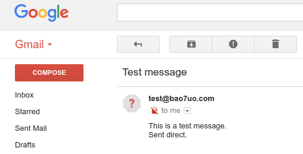

# mx-direct-mail-sender

Sends a direct email, with no relay required, by looking up the MX record and delivering the message to one of the resulting mail servers.

## Usage
```
mx-direct-mail-sender.py recipient@domain.com from@originator.com 'msg subject' $'msg body. Use \n to indicate a new line'
```


## Result
The following screenshot shows the resulting e-mail, which has arrived in the third-party mailbox - Gmail in this case.


## License

Author: Paul Taylor

See LICENSE file for details
